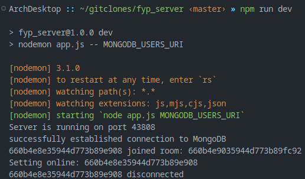

# Final Year Project - Uchi!
Back-end for android application done with Flutter framework as part of the Final Year Project programme for University. The goal of the project is to make an educational language learning app. This app is an umbrella which aims to bring features of apps like Anki and Duolingo and Tandem together. It features flash cards, translation challenges and the ability to make language exchange partners. The front-end can be found on the [fyp](https://github.com/DanielSGH/fyp) repository.

## Screenshots


# Steps to Build and Reproduce
1. Make sure git, nodejs, npm and MongoDB are installed and working correctly.
1. Clone the repository if not done already (remove # comment) and run server
```sh
# git clone https://github.com/DanielSGH/fyp_server.git &&\
npm install &&\
npm run dev
```
